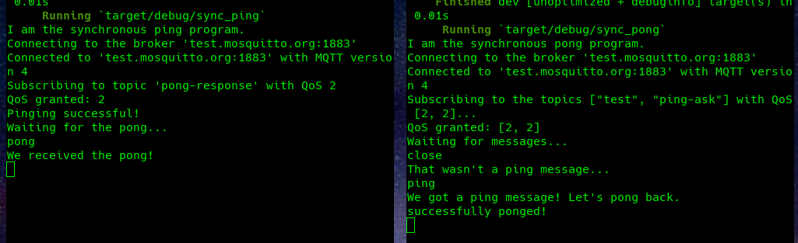

# MQTT ping-pong

Another way to have fun during confinement.




## Objectives

Get to know the [Eclipse Paho MQTT library](https://crates.io/crates/paho-mqtt) better,
by writing two simple client programs which do the following:

1. The `pinger` publishes a "ping" message to the topic "ping-ask" on a broker.
2. This "ping" is received by a listening `ponger` that responds with "pong" on *another* topic called "pong-response".
3. The `pinger` receives the "pong" response and rejoices much.

So each program:
* subscribes to a certain topic
* publishes on another one

As an objective, the Quality of Service we strive for is 2.

For additional fun, each program must exist in two versions: synchronous and asynchronous.

## Ressources

Let's use [mosquitto](http://mosquitto.org/)'s test server as a broker.

I made an extensive use of the [examples](https://github.com/eclipse/paho.mqtt.rust/tree/master/examples)
provided by the Paho MQTT library.
Some of this code is weird, though.

```rust
// examples/sync_consume.rs
if let Some((server_uri, ver, session_present)) = rsp.connect_response() { ... }
```

I couldn't find this `connect_response()` function anywhere in the library.

## How to run

Open *two* terminals in the project directory, and run *separately*:

```
cargo run --bin sync_pong
```

and

```
cargo run --bin sync_ping
```

Be sure to launch `sync_pong` first, otherwise it won't catch the single message that
`sync_ping` sends immediatly when starting.

### Why the huge ASCII text as comments in the code?

I don't know about you, but diving into six month old code is tedious,
and this repository is meant as a learning exercise to be re-read for generations to come.  
Plus, ASCII art is fancy.